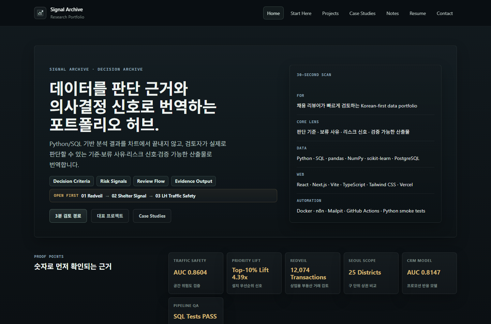
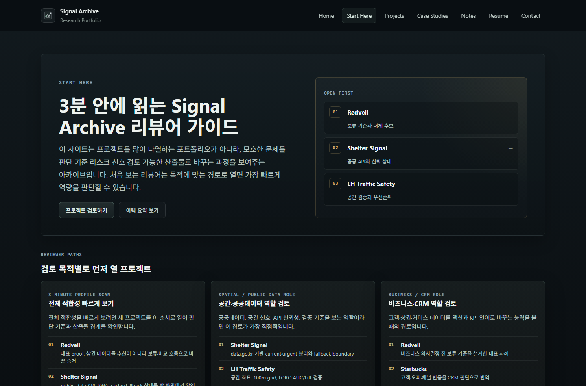
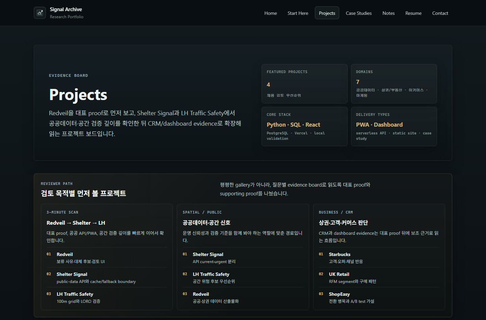
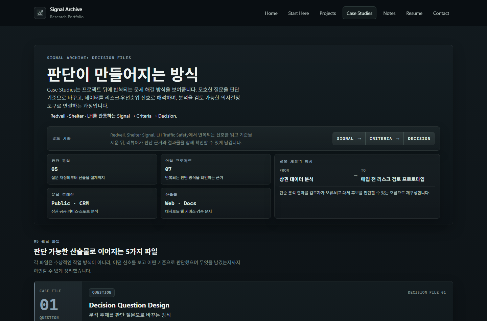

# Signal Archive

<p align="center">
  <strong>데이터 기반 의사결정 아카이브 · 포트폴리오 허브</strong>
</p>

<p align="center">
  분석 프로젝트를 단순히 모아두는 공간이 아니라,<br/>
  질문이 어떻게 문제로 구조화되고, 데이터가 어떻게 판단 기준과 리스크 신호가 되는지 기록하는 아카이브입니다.
</p>

<p align="center">
  <a href="https://signal-archive.vercel.app/"><strong>Live Portfolio</strong></a>
  ·
  <a href="https://signal-archive.vercel.app/start-here"><strong>Reviewer Guide</strong></a>
  ·
  <a href="docs/reviewer-path.md"><strong>Reviewer Path</strong></a>
  ·
  <a href="https://github.com/dffxonnb-cyber"><strong>GitHub Profile</strong></a>
</p>

<p align="center">
  
  
  
  
</p>

---

## Overview

**Signal Archive**는 데이터 분석 프로젝트를 단순히 나열하는 포트폴리오가 아니라, 각 프로젝트가 어떤 질문에서 출발해 어떤 판단 기준, 리스크 신호, 대시보드, 웹 기반 검토 흐름으로 발전했는지 기록하는 공간입니다.

```text
Problem → Data → Criteria → Judgment → Output
```

분석 결과를 차트 몇 개로 보여주는 데서 멈추지 않고, 리뷰어가 실제로 판단할 수 있는 기준, 우선순위, 비교 구조, 의사결정 화면으로 연결하는 것을 목표로 합니다.

---

## Live Preview

| Home | Start Here |
| --- | --- |
|  |  |

| Projects | Case Studies |
| --- | --- |
|  |  |

---

## Reviewer Paths

| Review Goal | Suggested Path | What it shows |
| --- | --- | --- |
| **3-minute profile scan** | [Start Here](https://signal-archive.vercel.app/start-here) → [Redveil](https://signal-archive.vercel.app/projects/seoul-storefront-redveil) → [Shelter Signal](https://signal-archive.vercel.app/projects/shelter-signal) | 포지셔닝, 대표 프로젝트, live product evidence |
| **Spatial / Public Data role** | [LH Traffic Safety](https://signal-archive.vercel.app/projects/lh-traffic-safety-analysis) → [Shelter Signal](https://signal-archive.vercel.app/projects/shelter-signal) → [Redveil](https://signal-archive.vercel.app/projects/seoul-storefront-redveil) | 격자 기반 위험 신호, 공공데이터 API, 공간·도시 의사결정 구조 |
| **Business / CRM role** | [Redveil](https://signal-archive.vercel.app/projects/seoul-storefront-redveil) → [Starbucks Promotion](https://signal-archive.vercel.app/projects/starbucks-promotion-analysis) → [UK Online Retail](https://signal-archive.vercel.app/projects/uk-online-retail-segment-analysis) | 리스크 판단, 고객 반응 예측, 세그먼트 액션 설계 |

더 자세한 검토 순서는 [docs/reviewer-path.md](docs/reviewer-path.md)에 정리했습니다.

---

## Featured Projects

| Project | Decision Question | Main Evidence | Review |
| --- | --- | --- | --- |
| **Seoul Storefront Redveil** | 매입 전에 먼저 보류해야 할 신호는 무엇인가? | 서울 상권·실거래 기반 리스크 신호, 보류 사유, 대체 후보 비교, GitHub Pages live product | [Detail](https://signal-archive.vercel.app/projects/seoul-storefront-redveil) · [Live](https://dffxonnb-cyber.github.io/Seoul-Storefront-Redveil/) · [Repo](https://github.com/dffxonnb-cyber/Seoul-Storefront-Redveil) |
| **Shelter Signal** | 보호 종료가 가까운 공공데이터 공고를 어떻게 먼저 확인하게 만들 것인가? | Vercel `/api/notices`, KST freshness normalization, current/urgent/archive views, cache/fallback boundary, PWA UI | [Detail](https://signal-archive.vercel.app/projects/shelter-signal) · [Live](https://shelter-signal-ebon.vercel.app/) · [Repo](https://github.com/dffxonnb-cyber/shelter-signal) |
| **LH Traffic Safety Analysis** | 사고 이력이 부족한 신도시에서 어디를 먼저 검토할 것인가? | 100m grid risk signal, LORO validation, Mean AUC 0.8604, Top-10% Lift 4.39x | [Detail](https://signal-archive.vercel.app/projects/lh-traffic-safety-analysis) · [Repo](https://github.com/dffxonnb-cyber/LH-traffic-safety-analysis) |
| **Starbucks Promotion Analysis** | 어떤 고객군에 어떤 오퍼를 어떤 채널로 제안할 것인가? | 고객-오퍼 이벤트 재구성, AUC 0.8147, Recall 0.8712, CRM decision dashboard | [Detail](https://signal-archive.vercel.app/projects/starbucks-promotion-analysis) · [Repo](https://github.com/dffxonnb-cyber/starbucks-promotion-analysis) |
| **UK Online Retail Segment Analysis** | 누구를 유지·재활성화 우선순위로 볼 것인가? | RFM, Pareto, statistical tests, campaign action design | [Detail](https://signal-archive.vercel.app/projects/uk-online-retail-segment-analysis) · [Repo](https://github.com/dffxonnb-cyber/UK-OnlineRetail-Segment-analysis) |
| **ShopEasy** | 주문·전환·이탈 병목을 어떤 실험으로 개선할 것인가? | deterministic synthetic dataset, conversion dashboard, A/B test proposal | [Detail](https://signal-archive.vercel.app/projects/shopeasy) · [Live](https://dffxonnb-cyber.github.io/ShopEasy/) · [Repo](https://github.com/dffxonnb-cyber/ShopEasy) |

---

## Core Strengths

| Strength | Description |
| --- | --- |
| **Problem Framing** | 모호한 질문을 분석 단위, 측정 기준, 검토 흐름으로 나누어 판단 가능한 문제로 재구성합니다. |
| **Risk & Priority Design** | 단순 수치 비교가 아니라, 무엇을 보류하고 무엇을 먼저 검토해야 하는지 설명 가능한 신호를 설계합니다. |
| **Analysis to Interface** | 분석 결과를 보고서 안에만 두지 않고 대시보드, 지도, 웹 페이지, 리뷰 화면으로 연결합니다. |
| **Decision Language** | 모델 점수와 지표를 과장하지 않고, 실제 검토자가 이해할 수 있는 판단 언어로 번역합니다. |
| **End-to-End Delivery** | 데이터 준비, 분석, 기준 설계, 시각화, 문서화, 검증 흐름까지 하나의 결과물로 연결합니다. |

---

## Tech Stack

| Area | Tools |
| --- | --- |
| **Analysis** | Python, pandas, SQL, scikit-learn, Jupyter |
| **Visualization / BI** | Tableau, Streamlit, pydeck, Matplotlib, Seaborn |
| **Web / Delivery** | HTML, CSS, JavaScript, React, Next.js, TypeScript, GitHub Pages, Vercel |
| **Data / API** | PostgreSQL, Neon, public-data APIs, serverless API routes |
| **Spatial Analysis** | GeoPandas, QGIS, GeoJSON, spatial grid analysis |
| **Validation** | GitHub Actions, public artifact checks, smoke tests |

---

## Review the Archive

| Route | What it shows |
| --- | --- |
| [Start Here](https://signal-archive.vercel.app/start-here) | 역할 적합도, 프로젝트 근거, 다음 검토 경로를 안내하는 리뷰어용 시작 페이지 |
| [Projects](https://signal-archive.vercel.app/projects) | 프로젝트별 문제 정의, 분석 방법, 산출물, 링크, 검증 신호 |
| [Case Studies](https://signal-archive.vercel.app/case-studies) | 리스크 신호, 의사결정 도구, 비즈니스 해석 방식의 반복 패턴 |
| [Resume](https://signal-archive.vercel.app/resume) | 기술 역량, 역할 적합도, 프로젝트 기반 경험 요약 |
| [Contact](https://signal-archive.vercel.app/contact) | 공개 연락처와 포트폴리오 링크 |

---

## Repository Guide

포트폴리오 문구와 프로젝트 정보는 구조화된 TypeScript 콘텐츠로 관리합니다.

| File | Role |
| --- | --- |
| `content/profile.ts` | 포지셔닝, 강점, 연락처, 기술 스택 |
| `content/projects.ts` | 프로젝트 카드, 상세 페이지, 의사결정 질문, 근거, 링크 |
| `content/proof-points.ts` | 상단 핵심 근거와 프로젝트 증거 |
| `content/case-studies.ts` | 반복되는 문제 해결 패턴과 사례 구조 |
| `content/writing.ts` | 글쓰기 디렉터리 및 아티클 콘텐츠 |
| `docs/reviewer-path.md` | 역할별 추천 검토 순서 |

콘텐츠 업데이트 흐름은 `PORTFOLIO_UPDATE_GUIDE.md`, 검증 범위는 `VERIFY.md`에서 확인할 수 있습니다.

---
